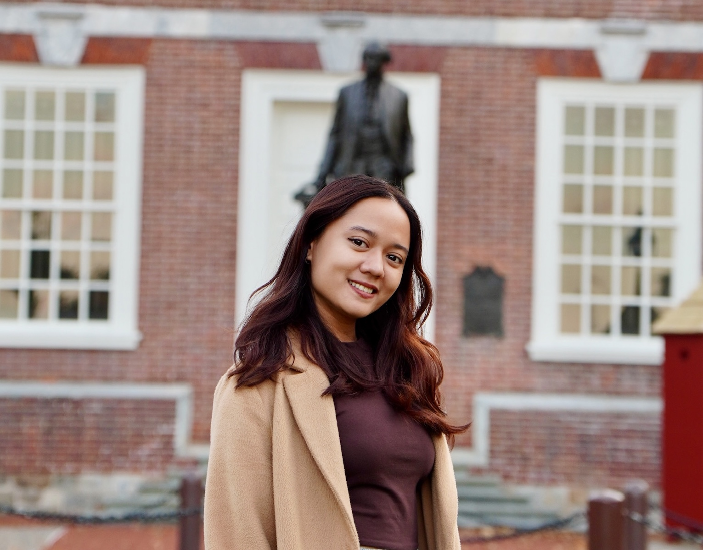

::: {.about-hero}
::: {.about-intro}
Most of my work comes back to one theme: did this change actually *cause* that outcome? And if yes, by how much?

I spent five years answering those questions in industry, running experiments and building models for a travel platform, a bank, and a logistics company. I am now finishing an M.A. in Quantitative Methods in the Social Sciences at Columbia, where I apply the same causal methods to economic history and development research.

The thread connecting all of it is a question I picked up growing up in Indonesia: how do we improve lives in places that are often overlooked? I care about rigorous evidence because I think programs in the Global South deserve the same careful evaluation that tech companies give a new app feature.

```{=html}
<div class="about-links">
  <a href="mailto:azzahra.ndhr@gmail.com"><i class="bi bi-envelope"></i> Email</a>
  <a href="https://www.linkedin.com/in/azzahrandhr/"><i class="bi bi-linkedin"></i> LinkedIn</a>
</div>
```
:::

```{=html}
<div class="about-photo"></div>
```
:::

## Outside of work

I spend a lot of my free time moving: lifting at the gym, jogging, and exploring parks around the city. Park walks are better with company, so if you're up for a long walk and a longer conversation, I'm in.

Running is the one I could talk about for twenty minutes. My left leg is weaker than my right, so I'm always reading up on drills and strength work that might help me run stronger and more evenly. It has turned running into a small, ongoing experiment of its own.

I also love to cook, mostly Indonesian food, because it's what I miss most about home. Right now I'm working on mastering *cumi hitam*, squid cooked in its own black ink, which is my favorite dish. And I make a mean Dubai chocolate.

I read a lot too, and I'm always looking for book clubs and people to talk about books with. You can see what I'm reading on my [reading list](reading.qmd).

## Experience

::: {.cv-entry}
[Columbia Climate School, 4Oceans Project]{.cv-org} [Jan 2026 to present]{.cv-date}

[Research Assistant · New York City, USA]{.cv-role}

Estimating how the 1709 plague disrupted Baltic shipping with Difference-in-Differences and Local Projections, using 300+ years of historical shipping records.
:::

::: {.cv-entry}
[Penske Truck Leasing]{.cv-org} [May 2026 to Aug 2026]{.cv-date}

[Data Analyst Intern, Marketing Insight · Reading, USA]{.cv-role}

Used outlier and spatial analysis to size revenue opportunities, from vehicle dwell time at service locations to sales territory design and market expansion. Built a GIS tool that brings competitors, demographics, drive times, and zoning into one view.
:::

::: {.cv-entry}
[Traveloka]{.cv-org} [Jun 2021 to Jun 2025]{.cv-date}

[Senior Data Analyst, Platform & Cross Selling · Jakarta, Indonesia]{.cv-role}

Designed and analyzed 40+ A/B experiments across personalization and cross-selling. Wrote the company's A/B testing guide, which led to the first experiment run fully self-service by a product team. Built propensity and ranking models for flight add-ons, and defined a retention metric that became a 2025 company north-star metric.
:::

::: {.cv-entry}
[OCBC Bank]{.cv-org} [Sep 2020 to Jun 2021]{.cv-date}

[Data Analyst, Trade and Credit Control · Jakarta, Indonesia]{.cv-role}

Designed a transaction-level early warning system for corporate loans with the credit risk and compliance teams, which won 1st place in the OCBC Quality Project Competition.
:::

## Education

::: {.cv-entry}
[Columbia University]{.cv-org} [2025 to 2026]{.cv-date}

[M.A. Quantitative Methods in the Social Sciences, Data Science and Experimentation Track]{.cv-role}

Funded by LPDP, the Indonesian government's merit scholarship. Coursework in causal inference, field experiments, machine learning, NLP, and GIS.
:::

::: {.cv-entry}
[Bandung Institute of Technology]{.cv-org} [2016 to 2020]{.cv-date}

[B.S. Physics, minor in Granular and Computational Simulation]{.cv-role}

Thesis: a neural network that predicts granular physics simulation outcomes about 380x faster than running the simulation. Co-authored a paper in [AIP Conference Proceedings](https://pubs.aip.org/aip/acp/article/2169/1/040006/611069) (2019).
:::

## Mentoring

- **Generation Girls** (2022 to 2025). Taught data science to girls aged 14 to 20.
- **Muda Bermula** (2022). Helped middle school students explore career paths.
- **Lab Assistant, Computational Physics, ITB** (2020). Supported 100+ students across 9 topics.

## Toolkit

- **Methods:** A/B testing, Difference-in-Differences, Local Projections, panel fixed effects, causal impact, ranking and propensity models
- **Languages:** Python, R, SQL, Stata
- **Tools:** BigQuery, dbt, Airflow, GCP, Git, QGIS, ArcGIS, Tableau, Looker, Streamlit, Quarto
- **Spoken:** Indonesian (native), English
